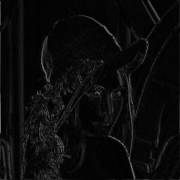

## Kartezijsko genetsko programiranje u konvoluciji slike 
## _Cartesian Genetic Programming for image convolution_

---

### Lukas Šestić, FER, 2021
#### Mentor: Domagoj Jakobovic, Ph. D. C. S.

---

Ciljevi:
* CGP Implementacija ✅
* Implementacija konvolucijskih metoda
  * Klizajući prozor (Sliding window) ✅
  * Izvođenje funkcija iz podataka dobivenih iz prozora ✅
* Ispitati mogućnosti konvolucijskog CGP-a na sljedećim zadacima:
  * Micanje šuma ✅
  * Razvoj filtera (npr. detektiranje rubova) ✅
* Istražiti mogućnosti rada kao autoencoder ✅

---

Projekt:
* Jezik: Swift 5.*
* Razvojna okolina: XCode

---

Upute za pokretanje eksperimenta:
1. Otvoriti projekt s XCode-om
2. U `main.swift` opisati izvođenje _eksperimenta_

* Eksperiment je definiran u `MasterThesis/CGP/Experiment/Protocol/Experiment.swift` kao protokol/sučelje
  * `Struct`, `Class` ili `Enum` koji implementira protokol mora implementirati metodu `work()`
* Primjer izvođenja

```swift
for _ in (0..<20) {

    let experiment = EdgeDetectionTest()

    experiment.startExperiment()
}
```
Navedeni kod će serijski 20 puta pokrenuti eksperiment `EdgeDetectionTest`.
Unutar tog eksperimenta navedena su pravila za checkpointove i izvor podataka.

--- 

Primjer izlaza:


